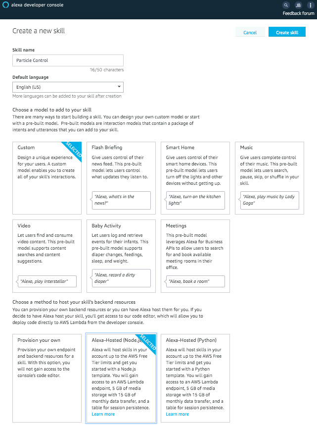
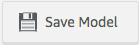
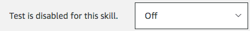
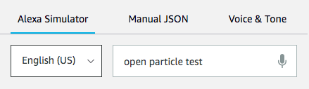
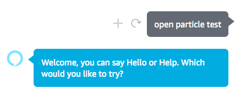

# Chapter 3: Building an Alexa Skill

| **Project Goal**            | Build an Alexa skill.                                                                                        |
| --------------------------- | ------------------------------------------------------------------------------------------------------------------------------------------------------------------------- |
| **What you’ll learn**       | How to design a voice user interface, build an Alexa skill, and test it. |
| **Tools you’ll need**       | Access to the internet for developer.amazon.com                                                                                                            |
| **Time needed to complete** | 30 minutes                                                                                                                                                                |

In this lab, you'll build an initial Alexa skill, and learn how to test it to make sure everything is working as expected.

::: tip Did you come prepared?
Make sure you have completed **all** the [preparations](README.md) before advancing beyond this point.
:::

## Go to the Alexa Developer Console

Our recommendation is to use the same credentials you use when shopping at amazon.com.  This will make your life much easier when you want to test your Alexa skills on your own devices.

1. Visit the [Alexa Developer Console](https://developer.amazon.com/alexa/console/ask) and log in.

## Create Your Alexa Skill

1. Click the blue "Create Skill" button.

2. Name your skill "Particle Control".  (This can be changed later.)

3. Select "Custom" as your model.

4. Select "Alexa-Hosted (Node.js)" as your skill's backend resources.  This will create an AWS Lambda function to host your skill that Alexa pays for.

Your screen should look like this:

5. Click the blue "Create skill" button.

6. Choose the "Hello World Skill" as your selected template.

7. Click the blue "Choose" button.

The Developer Console will create your skill for you.  This should take 60-90 seconds.

## Modifying Your Alexa Skill

The first screen you see has lots of information on it, but our focus will be exclusively on the navigation on the left and top of the screen.

1. In the left-side navigation, select "Invocation".

2. Change the default value ("change me") to be what our users will call our skill: "particle control".  (Make sure to use all lower case letters.)

3. Click the "Save Model" button above.

4. Click the "Build Model" button above.  This will take approximately 45 seconds.

5. In the left-side navigation, click the "HelloWorldIntent".

Here, you can see the list of sample utterances that have been created for this intent.  You can add more, or leave them as is.  (If you make changes, you will need to "Save" and "Build" again.)

6. In the top navigation, click the "Code" button.

This is the node.js function that has been created for our simple Hello World skill.  There are several sections to this code, one for each type of response we expect from our users.  Here's the quick highlights:

* Line 6: The LaunchRequestHandler is called when the user opens your skill by saying "open particle control".
* Line 18: The HelloWorldIntentHandler is called when the user says one of the sample utterances (or something similar) from our HelloWorldIntent.
* Line 108: This is the entry point to our skill, and it has a list of all of the handler functions we want available in our code.

7. In the top navigation, click the "Test" button.

8. Change the testing dropdown from "Off" to "Development."

9. In the Alexa Simulator, type "open particle test", and press Enter.

10. You should receive a response that says "Welcome, you can say Hello or Help.  Which would you like to try?"

You should also review the JSON Input and JSON Output boxes.  The input JSON is what Alexa sent to your code, and the output JSON is what your code sent back to Alexa.  This will become more important in Lab 4, when we add new intents and custom responses.  Notice the "LauchRequest" at the bottom of the input JSON.  This indicates that the user opened our skill.

11. In the Alexa Simulator, type "hello", and press Enter.

You should get a response back from your skill that says "Hello World."  Notice that the input JSON contains the HelloWorldIntent this time, because the user said something that matches the sample utterances for that intent.

CONGRATULATIONS!  You have a working Hello World Alexa skill!  In Lab 4, we are going to modify this skill to call the Particle API to change the color of our LED, and determine the temperature and humidity of the room!
