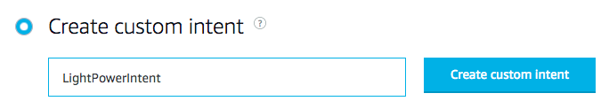
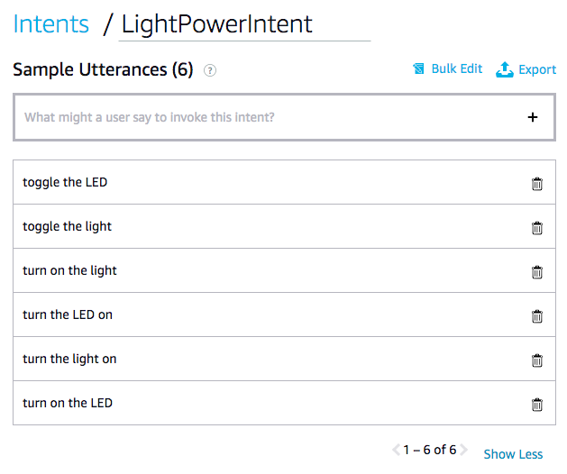
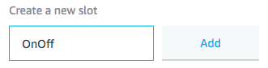
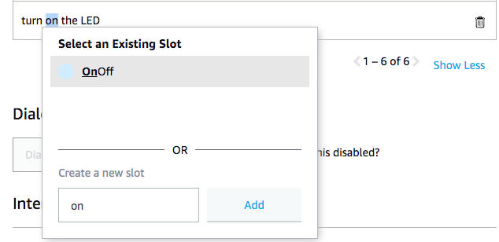
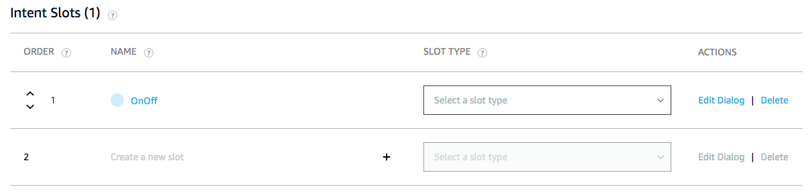
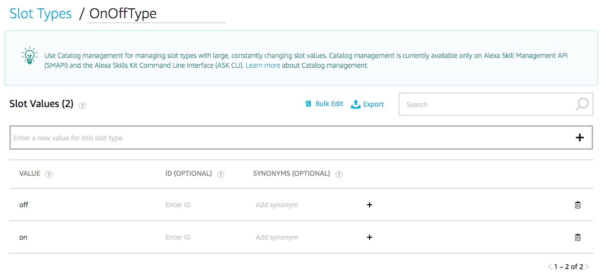
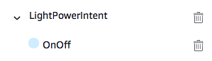
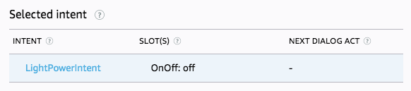
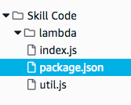
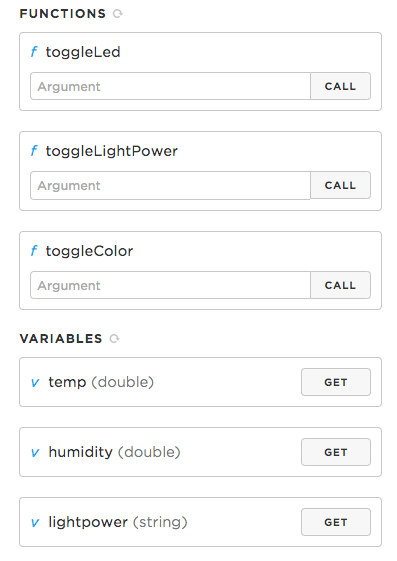

# Chapter 4: Talking to Particle from Alexa

| **Project Goal**            | Control your particle device from your Alexa skill.                                                                                                                       |
| --------------------------- | ------------------------------------------------------------------------------------------------------------------------------------------------------------------------- |
| **What you’ll learn**       | Building advanced voice interfaces, how to make HTTPS calls |
| **Tools you’ll need**       | Access to the internet for developer.amazon.com and build.particle.io                                                                                                            |
| **Time needed to complete** | 60 minutes                                           |

This lab will require you to open several tabs in your browser.  It is highly recommended that you open all pages in a new tab, since we will be referring back to each of them frequently.

## Open the Alexa Developer Console.

1. Visit the [Alexa Developer Console](https://developer.amazon.com/alexa/console/ask) and log in.

## Add a new intent called "LightPowerIntent".

1. On the "Build" tab of the Alexa Developer Console, in the left navigation, click the "Add" button next to Intents.


2. Type "LightPowerIntent" into the "Create custom intent" textbox, and then click the "Create custom intent" button.



3. Now we need to provide a list of sample utterances for our intent that represent what a user might say to make this happen.  Here's a short sample list to start with, but you can add more to meet your needs.  Type or copy each value into the textbox, and press Enter to add it to the list.

* turn on the LED
* turn the light on
* turn the LED on
* turn on the light
* toggle the light
* toggle the LED

Your list should look like the one below.



You'll notice that we only provide the "on" states for these sample utterances.  We are actually going to create a SLOT to handle the on/off values for these utterances next.

4. Highlight the word "on" in one of your sample utterances.


5. Change the value in the textbox to "OnOff" and click the "Add" button.



6. For each of the other "on" values in our sample utterances, highlight the word, and select our new slot from the existing list.



7. You should now see "OnOff" listed in your "Intent Slots" section at the bottom of the page.



This slot does not currently have a slot type selected, and we need to create one that can handle the values "on" and "off".

8. In the left navigation, click the "Add" button next to Slot Types.


9. Create a new custom slot type named "OnOffType", and click the "Create custom slot type" button.


10. This slot type will only have two possible values: "on" and "off".  Add them to the list of slot values.



11. In the left navigation, find your "OnOff" slot that is under your LightPowerIntent, and click on it.



12. In the "Slot Type" dropdown, select our new "OnOffType" slot type.


13. Build your model by clicking the "Build Model" button at the top of the screen.


14. We can quickly test our sample utterances using the Evaluate Model tool.  Click "Evaluate Model" at the top right of the screen.


15. In the "Utterance Profiler" tab, type an expected user utterance, like "turn on the light".


What you will see is the natural language understanding (NLU) results for your utterance against your Interaction Model.  It should show that the selected intent is "LightPowerIntent", and the slot value is "on".  We will be able to access these values in our code, and make decisions based on these values.



Now that we know our LightPowerIntent is working as expected, we can write the code for our device (and our skill) to make this magic happen.

## Modifying our device firmware

In order to allow our users to turn their light on or off, we need to add some additional code to the device firmware.  To do this, we are going to add a new variable, and a new function to handle powering the LED.

1. Declare a new String variable called "lightpower". This can go immediately after the other variables you've declared, like "temp", "humidity", or "currentLightLevel".

```cpp
String lightpower;
```

2. In the setup() function, declare "lightpower" as a Particle variable.

```cpp
Particle.variable("lightpower", lightpower);
```

3. In the setup() function, declare "toggleLightPower" as a Particle function. (We haven't created this function yet, but that's our next step.)

```cpp
Particle.function("toggleLightPower", toggleLightPower);
```

4. At the very bottom of our code file, add the function toggleLightPower().  This function sets the light to on or off depending on the command we send, and if we don't provide a command, it toggles the state.

```cpp
int toggleLightPower(String command) {
    if (command == "on") {
        leds.setColorHSB(0, 0.0, 1.0, 1.0);
        Particle.publish("[ON] Alexa updated lightpower state to ON.");
        lightpower = command;
        return 1;
    }
    else if (command == "off") {
        leds.setColorHSB(0, 0.0, 0.0, 0.0);
        Particle.publish("[OFF] Alexa updated lightpower state to OFF.");
        lightpower = command;
        return 1;
    }
    else {
        if (lightpower == "on") toggleLightPower("off");
        else if (lightpower == "off") toggleLightPower("on");
    }
}
```

Now that we have updated our code, we need to flash our device, and test that it is working properly.

5. Flash your device with the new code.

6. Go to your Particle Device Portal, and verify that your new functions and variables are listed on the right side of the screen.


7. Type "on" into the "toggleLightPower" argument box, and press "Call."  It should turn your device's LED on.

8. Type "off" into the "toggleLightPower" argument box, and press "Call."  It should turn your device's LED on.

9. Click the "GET" button next to your "lightpower" variable, and it should tell you the current state of your device's LED.

10. Type "toggle" into the "toggleLightPower" argument box, and press "Call."  It should change the state of your device's LED from on to off, or off to on, depending on where you started.  Sending any other command other than "on" or "off" will toggle the state of the LED to the opposite.

## Updating our Alexa skill code

1. Back in the Alexa Developer Console, click the code tab at the top of the screen.  We need to make several changes to our project in order to call the Particle APIs.

2. First, click on the "package.json" file from the left navigation.



3. We need to add the Particle API Library as a dependency.  Add this line to your dependencies (make sure you have all of your commas in the right place!):

```cpp
"particle-api-js": "^8.0.1"
```

Once you've added this, you can close this file.  We won't need it again.

4. Open the index.js file from the left navigation.  (It might already be open, in which case you can just click on its tab.)

5. We need to add a reference to to the Particle API library in our code.  To do this, add this line immediately below the reference to "ask-api-core".

```cpp
const Particle = require('particle-api-js');
```

6. We will also need our Particle device ID.  You can find this on the Particle website, at https://console.particle.io/devices.  Add a line of code below the Particle API declaration to declare this value as a variable.

```cpp
var deviceId = "YOUR_DEVICE_ID_HERE";
```

7. You will also need your Particle access token.  To find this, go to https://build.particle.io and click on the Settings icon in the bottom left corner.  It will show you your "Personal Access Token" in the Settings panel.  This is used to authenticate access to your account, so keep this value private.  Add this value to your code immediately below your deviceId:

```cpp
var token = "YOUR_PERSONAL_ACCESS_TOKEN_HERE";
```

Now that we have the basic plumbing out of the way, we can add the code that will actually make our light work with our voice.

8. We are going to add a new handler, called "LightPowerIntentHandler" to handle our user's voice commands, and make the calls to our Particle device.  You can put this anywhere in your index.js file, just insert it between any of the other existing handlers.

```cpp
const LightPowerIntentHandler = {
    canHandle(handlerInput) {
        return Alexa.getRequestType(handlerInput.requestEnvelope) === 'IntentRequest'
            && Alexa.getIntentName(handlerInput.requestEnvelope) === 'LightPowerIntent';
    },
    handle(handlerInput) {
        var command = "toggle";
        if (handlerInput.requestEnvelope.request.intent.slots.OnOff.value !== undefined) command = handlerInput.requestEnvelope.request.intent.slots.OnOff.value;
        var particle = new Particle();
        particle.callFunction({ deviceId: deviceId, name: "toggleLightPower", argument: command.toString(), auth: token })
        
        var speakOutput = "Your LED state has been updated";
        if (command !== "toggle") speakOutput += " to " + command + ".";
        return handlerInput.responseBuilder
            .speak(speakOutput + "<break time='.25s'/>What else can I do for you?")
            .reprompt("What else can I do for you?")
            .getResponse();
    }
}
```

In this handler, we are checking to make sure that the LightPowerIntent was requested by the user, and then we determine what their slot value was (either "on", "off" or undefined).  We then make a call to the Particle API with the deviceId, function name, and slot value, using our authentication token.  Finally, we create a sentence that lets the user know that we executed their request.

9. The final step to make this work is to add the name of our handler to our exports.handler statement in the addRequestHandlers() method.  These handlers are checked in the order they are written, so it is recommended that you order your handlers in this list from most specific to least specific.  This becomes especially useful when you have a much more robust skill with dozens of handlers for different intents and states.  For our purposes today, put it immediately under the HelpIntentHandler, so that your list looks like this:

```cpp
.addRequestHandlers(
    LaunchRequestHandler,
    HelloWorldIntentHandler,
    HelpIntentHandler,
    LightPowerIntentHandler,
    CancelAndStopIntentHandler,
    SessionEndedRequestHandler,
    IntentReflectorHandler, // make sure IntentReflectorHandler is last so it doesn't override your custom intent handlers
)
```

10. Click Save at the top of the screen.

11. Click Deploy at the top of the screen.  We can now test our skill.

12. Open the "Test" tab from the top navigation.

13. In the Alexa Simulator, type "open particle control" and press Enter.

14. After you recieve your response, type a second command: "turn on the light".  This should light up your LED.  (If your light is already on, tell it to "turn off the light".)

Congratulations!  You now have an Alexa skill that can change the state of your LED on your Particle device!  We have much more functionality to add to this skill (and firmware), so let's keep going!  The steps required to accomplish these next sections will be much faster, since we did almost all of the plumbing for the first one.

## Asking for the room temperature

1. Create a new custom intent for our skill in the "Build" tab of the Alexa Developer Console, called "TemperatureIntent."  To do this, go to the "Build" tab of the Alexa Developer Console, and click the "Add" button next to "Intents".


2. For the sample utterances, we won't have a slot this time.  We are only asking the device to tell us the current temperature detected by the Temperature and Humidity Sensor.  So you can use a list like the one below.  Feel free to add additional utterances that you think users might say when asking for the device temperature.

* what is the temperature
* give me the device temperature
* temperature
* temp
* how warm is it
* how cold is it
* how many degrees is it
* what does the temperature sensor say

3. Build your model to finish this step.


4. Use the Evaluate Model tool to verify that your intent is working as expected.  Type "what is the temperature" to make sure your intent is being selected appropriately.


5. Navigate back to the "Code" tab, where we will add another handler for our new intent to our index.js file.

6. Add the following handler to your code.  This will make another call to the Particle API to retrieve the current value of "temp" that we created earlier.

```cpp
const TemperatureIntentHandler = {
    canHandle(handlerInput) {
        return Alexa.getRequestType(handlerInput.requestEnvelope) === 'IntentRequest'
            && Alexa.getIntentName(handlerInput.requestEnvelope) === 'TemperatureIntent';
    },
    async handle(handlerInput) {
        var particle = new Particle();
        return await particle.getVariable({ deviceId: deviceId, name: 'temp', auth: token }).then(function(data) {
            console.log("RESULT = " + JSON.stringify(data));
            var speakOutput = "Your temperature sensor says it is " + parseInt(data.body.result) + " degrees fahrenheit.";
            return handlerInput.responseBuilder
                .speak(speakOutput + "<break time='.25s'/>What else can I do for you?")
                .reprompt("What else can I do for you?")
                .getResponse();
        }, function(err) { console.log('An error occurred while getting attrs:', err);return 0;});
    }
}
```

7. Make sure to add the name of the handler ("TemperatureIntentHandler") to the exports.handler list at the bottom of index.js.

8. Save and Deploy your code.

8. You can now test your skill on the "Test" tab, and ask for the temperature from your device!

## Changing the color of the LED

For this functionality, we will need to be able to translate color names into color values that our device can understand.  Let's start with the Particle firmware, since we will need a new function.

1. Go back to the Particle Web IDE, and declare "toggleColor" as a new function in the setup() method.

```cpp
Particle.function("toggleColor", toggleColor);
```

2. Add this new function to the bottom of your firmware code.  As you can see, we will be translating color names to RGB values.  If you had a library with this data, you could support an infinite number of color names, but for our purposes in this lab, we'll restrict our list to just the common colors of the rainbow, and white.

```cpp
int toggleColor(String command) {
    if (command == "red")         leds.setColorRGB(0, 255, 0, 0);
    else if (command == "orange") leds.setColorRGB(0, 255, 165, 0);
    else if (command == "yellow") leds.setColorRGB(0, 255, 255, 0);
    else if (command == "green")  leds.setColorRGB(0, 0, 255, 0);
    else if (command == "blue")   leds.setColorRGB(0, 0, 0, 255);
    else if (command == "purple") leds.setColorRGB(0, 128, 0, 128);
    else leds.setColorHSB(0, 255, 255, 255);

    Particle.publish("[" + command.toUpperCase() + "] Alexa updated LED color to " + command + ".");
    return 1;
}
```
Now that we have updated our code, we need to flash our device, and test that it is working properly.

5. Flash your device with the new code.

6. Go to your Particle Device Portal, and verify that your new function is listed on the right side of the screen.



7. Type "green" into the "toggleColor" argument box, and press "Call."  It should turn your device's LED on, and set it to green.

8. Type "red" into the "toggleColor" argument box, and press "Call."  It should turn your device's LED on, and set it to red.

9. Type "lavender" into the "toggleColor" argument box, and press "Call."  It should turn your device's LED on, and set it to WHITE.  This is because we don't support "lavender" as one of our colors.

10. Create a new custom intent for our skill, called "ColorIntent."  To do this, go to the "Build" tab of the Alexa Developer Console, and click the "Add" button next to "Intents".


11. Use these sample utterances for our new intent.

* change the color to {color}
* set the LED to {color}
* {color}
* change to {color}
* set the light to {color}
* change the light to {color}
* change the LED to {color}
* turn the light {color}

12. Adding those new sample utterances automatically created a slot for this intent.  We just need to set the slot type to be one of the built-in slot types: "AMAZON.Color".  This gives us a rich model that handles the name of all of the colors very effectively.


13. Build your model to finish this step.


14. Use the Evaluate Model tool to verify that your intent is working as expected.  Type "change the light to purple" to make sure your intent is being selected appropriately.


15. Navigate back to the "Code" tab, where we will add another handler for our new intent to our index.js file.

16. Add this handler to your index.js file.  This will send the color commands to our Particle function "toggleColor".

```cpp
const ColorIntentHandler = {
    canHandle(handlerInput) {
        return Alexa.getRequestType(handlerInput.requestEnvelope) === 'IntentRequest'
            && Alexa.getIntentName(handlerInput.requestEnvelope) === 'ColorIntent';
    },
    handle(handlerInput) {
        var speakOutput = "This skill currently only supports the colors of the rainbow and white.  Please select one of those colors.";
        if (handlerInput.requestEnvelope.request.intent.slots.color.value !== undefined) {
            var color = handlerInput.requestEnvelope.request.intent.slots.color.value.toLowerCase();
            if (["red", "orange", "yellow", "green", "blue", "purple", "white"].indexOf(color) >= 0) {
                var particle = new Particle();
                particle.callFunction({ deviceId: deviceId, name: "toggleColor", argument: color, auth: token })
                speakOutput = "The LED is now " + color;
            }
        }
        return handlerInput.responseBuilder
            .speak(speakOutput + "<break time='.25s'/>What else can I do for you?")
            .reprompt("What else can I do for you?")
            .getResponse();
    }
}
```

17. Make sure to add the name of the handler ("ColorIntentHandler") to the exports.handler list at the bottom of index.js.

18. Save and deploy your code.

19. You can now use the "Test" tab to test your skill using the Alexa Simulator.  Simple commands like "purple" or "red" will work, but more complex statements like "change the light to green" should also work.

CONGRATULATIONS!  You've completed this entire workshop!  You now know how to build an Alexa skill that talks to external APIs.  This is necessary in any advanced voice skill to store data, retrieve content, or even send external communication to your users.  What are you going to build next?

If you got lost in the code, here are some resources for you.

* [Alexa Interaction Model Final Code](https://github.com/bsatrom/particle-alexa-workshop/blob/master/labs/lab4/interactionModel.json) - In the left navigation of the Build tab in the Alexa Developer Console, you can choose JSON Editor to replace the entire Interaction Model with this file.
* [index.js Final Code](https://github.com/bsatrom/particle-alexa-workshop/blob/master/labs/lab4/index.js)
* [particle.ino Final Code](https://github.com/bsatrom/particle-alexa-workshop/blob/master/labs/lab4/particle.ino)

**And if you want to take your exploration further, click the "Extra" link below!**

**BEFORE YOU GO** we'd love it if you could provide feedback on this workshop. Please visit [this link](https://particleiot.typeform.com/to/JiF8xM) to rate your experience.
